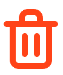

# Как создать многоразовую платёжную ссылку

Многоразовая (статическая) платёжная ссылка — это постоянная ссылка на оплату фиксированного товара или услуги.  
Её можно разместить на сайте, в соцсетях, мессенджерах, в описании профиля или использовать как QR‑код.

## Где создать многоразовую ссылку на оплату

1. Войдите в личный кабинет Robokassa.
2. В левом меню откройте раздел **«Платёжный виджет»**;
3. Выберите проект (магазин), для которого хотите создать статическую ссылку (если у вас несколько магазинов) и нажмите "Добавить".
4. У вас появится виджет‑ссылка, которой можно дать название (по иконке { .icon-inline }).
5. Укажите "Способ перехода к оплате" - "Ссылка" или "QR-код"
6. В "Состав заказа" добавьте "Наименование товара/услуги" и "Цену".
7. При желании, вы можете "Добавить позицию", если клиенту нужно оплатить сразу несколько товаров/услуг.
8. Нажмите кнопку "Создать" и у вас появится ссылка, которую можно скопировать.

Все созданнные виджеты (многоразовые ссылки) будут храниться в разделе на постоянной основе.  
Вы можете удалить их в любой момент (по иконке { .icon-inline }).

### Дополнительные необязательные параметры платёжной ссылки

При создании счёта можно заполнить дополнительные поля:

- **`Описание заказа`** — что именно оплачивает клиент (товар, услуга, период, номер договора и т.п.). Видно на платёжной странице.
- **`SuccessUrl2`** — дополнительный адрес, на который клиент будет перенаправлен после успешной оплаты (например, на личный кабинет или страницу с материалами).
- **`FailUrl2`** — дополнительный адрес для перенаправления при неуспешной оплате (например, страницу с инструкцией по повторной оплате).
- **`Язык формы`** — можно задать, на каком языке будет отображаться платёжная форма (русский или английский).

**Параметры платежа в чеке (справа):**  

??? example "**Оплата** — признак способа расчёта (тег 1214):"

    1. **`Предоплата 100% (код 3)`** — полная оплата заранее за будущую поставку/услугу. Позже пробивается чек полного расчёта с зачётом.  
    2. **`Предоплата (код 2)`** — частичная оплата за конкретный товар/услугу до передачи. Указывается предмет расчёта с деталями.  
    3. **`Аванс (код 1)`** — деньги внесены заранее без указания конкретных товаров/услуг (депозит, залог).  
    4. **`Полный расчёт (код 4)`** — **самый популярный вид оплаты.** Оплата в момент передачи товара/услуги. Детализация позиций.  
    5. **`Частичный расчёт (код 6)`** — часть оплачена сразу, остаток в кредит. Распределяются способы оплаты.  
    6. **`Передача в кредит (код 5)`** — товар/услуга переданы без оплаты. Позже пробиваются чеки оплаты кредита.  
    7. **`Кредит (код 7)`** — последующие платежи по ранее выданному кредиту. Предмет — «платёж», сумма чека равна полной стоимости.
 
??? example "**Тип** — предмет расчёта для каждой позиции в чеке (тег 1212):"

    1. **`Товар`** — физический товар, реализуемый продавцом.  
    2. **`Подакцизный товар`** — товары с акцизами (алкоголь, табак и т.п.).  
    3. **`Работа`** — выполненные работы (ремонт, строительство и т.п.).  
    4. **`Услуга`** — оказанные услуги (консультации, транспорт и т.п.).  
    5. **`Ставка азартной игры`** — приём ставок в казино, букмекерских конторах и т.п.  
    6. **`Выигрыш азартной игры`** — выплата выигрыша по азартным играм.  
    7. **`Лотерейный билет`** — продажа лотерейного билета.  
    8. **`Выигрыш лотереи`** — выплата лотерейного выигрыша.  
    9. **`Предоставление результатов интеллектуальной деятельности`** — лицензии, патенты, программное обеспечение.  
    10. **`Платёж`** — денежные платежи (погашение кредитов, займов и т.п.).  
    11. **`Агентское вознаграждение`** — комиссия агента за посредничество.  
    12. **`Составной предмет расчёта`** — комбинация нескольких типов (например, товар + услуга).  
    13. **`Иной предмет расчёта`** — всё, что не вошло в другие категории.  
    14. **`Имущественное право`** — передача прав на имущество.  
    15. **`Внереализационный доход`** — прочие доходы (штрафы, бонусы и т.п.).  
    16. **`Страховые взносы`** — взносы в страховые фонды.  
    17. **`Торговый сбор`** — сбор за торговую деятельность.  
    18. **`Туристический налог`** — курортный/туристический сбор.  
    19. **`Финансовый инструмент`** — ценные бумаги, вклады и другие финансовые инструменты.

??? example "**Налог** — ставка НДС для позиции в чеке (тег 1191):"

    1. **`Без НДС`** — операции, не облагаемые НДС (например, экспорт, льготные виды деятельности).  
    2. **`НДС 0%`** — нулевая ставка НДС.  
    3. **`НДС +10%`** — расчётная ставка: сумма НДС входит в цену, считается как `цена * 10/110`.  
    4. **`НДС 10/110`** — сумма НДС выделена отдельно и соответствует 10% от налогооблагаемой базы.  
    5. **`НДС +20%`** — расчётная ставка: сумма НДС входит в цену, считается как `цена * 20/120`.  
    6. **`НДС 20/120`** — сумма НДС выделена отдельно и соответствует 20% от базы.  
    7. **`НДС +5%`** — расчётная ставка: сумма НДС входит в цену, считается как `цена * 5/105`.  
    8. **`НДС 5/105`** — сумма НДС выделена отдельно и соответствует 5% от базы.  
    9. **`НДС +7%`** — расчётная ставка: сумма НДС входит в цену, считается как `цена * 7/107`.  
    10. **`НДС 7/107`** — сумма НДС выделена отдельно и соответствует 7% от базы.  
    11. **`НДС +22%`** — расчётная ставка (с 2026 года): сумма НДС входит в цену, считается как `цена * 22/122`.  
    12. **`НДС 22/122`** — сумма НДС выделена отдельно и соответствует 22% от налогооблагаемой базы (нововведение 2026 года).

---

## Когда стоит использовать статическую ссылку через виджет

- Услуга или продукт продаются по **фиксированной цене** (консультация, подписка, пакет услуг).
- Вам нужна **одна постоянная ссылка**, которую можно разместить в шапке профиля, на лендинге, в рассылке.
- Часто используется, если нужно быстро запустить акцию на определённый товар/услуг в соц.сетях.

## Чем статическая ссылка через виджет отличается от разовой

- **Разовая платёжная ссылка** привязана к конкретному счёту и перестаёт работать после первой оплаты.
- **Статическая ссылка через виджет** остаётся активной и подходит для неопределённого количества оплат одним и тем же способом.

## Вопросы и ответы

??? question "Как узнать, кто оплатил по многоразовой ссылке, если у всех одна и та же URL?"

    В разделе "Операции и возвраты" вы можете отслеживать все успешные транзакции и идентифицировать покупателей по e-mail, которые они оставляют при совершении платежа. 
	
	Если нужно собирать более подробную персональную информацию, вы можете реализовать это через Google или Яндекс Формы, а также, через форму сбора данных через telegram или VK бота.
	
	Не забудьте обязательно ознакомиться с законом о защите персональных данных (152-ФЗ), а также разместить политику сбора и обработки персональных данных.

??? question "Можно ли поменять цену по многоразовой ссылке?"

    Да. Цена берётся из настроек платёжного виджета.  
    Если вы измените сумму в настройках виджета, все последующие оплаты по этой ссылке будут проходить уже по новой цене.
	
??? question "Что делать, если нужно временно остановить приём оплат по многоразовой ссылке?"

    Откройте настройки платёжного виджета в личном кабинете и обновите виджет добавив любую новую позицию в счёт.  	

??? question "Можно ли использовать одну и ту же многоразовую ссылку на разных площадках?"

    Да. Одну и ту же ссылку можно разместить одновременно на сайте, в соцсетях, мессенджерах, в e‑mail‑рассылке и т.д.  
    Все оплаты будут попадать в один и тот же магазин/виджет, а вы будете видеть их в общей истории платежей.
	
??? question "Можно ли сделать многоразовую ссылку с произвольной суммой (чтобы клиент сам вводил сумму)?"

    Да, в настройках платёжного виджета можно выбрать режим с вводом произвольной суммы.  
    Этот вариант удобно использовать для пожертвований, донатов или частичной доплаты.
	
	При создании подобного виджета необходимо наличие любого веб-сайта, так как форма с произвольной суммой создаётся через скрипт.

