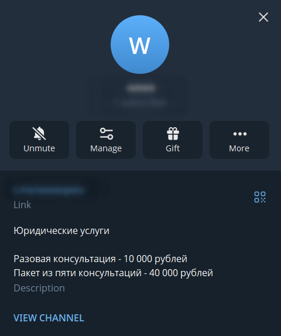
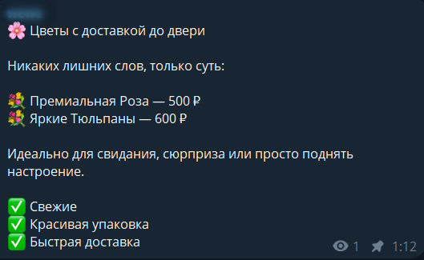
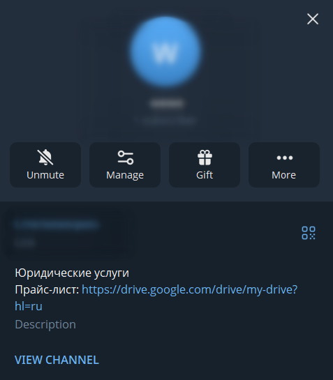
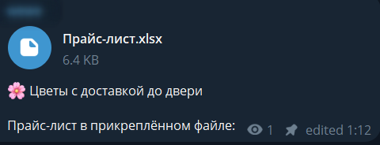
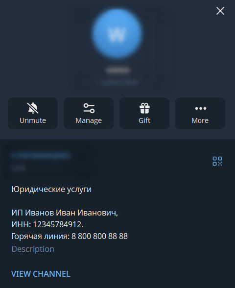

# Требования к подключению Telegram‑канала или бота

Перед подключением Robokassa убедитесь, что в вашем Telegram‑канале или боте есть вся обязательная информация.  
Это ускорит модерацию и поможет избежать отказа в подключении.

## Три общих правила.
**На странице Telegram‑канала или в боте должны быть расположены:**  

**1) Название и цены на товары/услуги;**  
Варианты размещения:  
??? example "в описании канала/бота"
    
    { style="max-width: 100%; height: auto;" }
    
    *В Telegram откройте информацию о канале/боте, нажмите «Изменить описание» и укажите информацию с ценами. Не забудьте сохранить изменения.*

??? example "в закреплённом сообщении"
    
    { style="max-width: 100%; height: auto;" }
    
    *Создайте пост с описанием товаров/услуг и ценами, затем закрепите его вверху чата или канала.*

??? example "в товарах/услугах (Telegram Shop)"
    
    { style="max-width: 100%; height: auto;" }
    
    *Если используете Telegram-бота как магазин, товары можно оформить через специальные платёжные решения или Mini Apps.*

??? example "в ссылке на облако"
    
    { style="max-width: 100%; height: auto;" }	
	
	*Загрузите файл прайс-листа в облачное хранилище: Google Disk, Yandex Drive и т.п.  
	Откройте доступ к файлу по ссылке и опубликуйте её в описании или закрепе.*

??? example "в файле прайс-листа"
    
    { style="max-width: 100%; height: auto;" }	
	
	*В Telegram файл можно прикрепить к закреплённому сообщению или отправить его в чат и закрепить.*

**`Цены должны быть указаны явно.`**  
**`Если у товаров/услуг нет фиксированных цен, их можно указать от и до.`**  
**`Например: "Юридические услуги от 10 000 до 50 000 рублей."`** 

**2) Оферта ИЛИ условия оплаты и возврата:**  
> **ВАЖНО: Вам не обязательно размещать оферту, если у вас в Telegram уже имеется понятное описание условий оплаты и возврата денежных средств.** 

**Условия оплаты и возврата можно разместить в описании сообщества, по ссылке на облако или в закреплённом посте.** 

??? example "Пример 1. Продажа товаров онлайн:"
	**Условия оплаты и возврата**  
	- В канале доступна оплата картой или через СБП и другими платёжными методами через сервис Robokassa.  
	- Доставка товара происходит с помощью сервиса СДЕК после оплаты заказа. Срок доставки 3-5 рабочих дней.  
	- Возврат денежных средств возможен в течение 14 дней с момента покупки, если товар имеет заводские характеристики и не имеет дефектов.  

??? example "Пример 2. Продажа онлайн-услуг:"
	**Условия оплаты и возврата**  
	- Оплата производится через бота или по ссылке картой или через СБП.  
	- Доступ к курсу/вебинару приходит в личные сообщения после оплаты в течение 5 минут.  
	- Возврат денег возможен при запросе в течение 14 дней, если услуга не была оказана (доступ к материалам не открыт).
	
??? example "Пример 3. Продажа офлайн-услуг:"
	**Условия оплаты и возврата**  
	- Бронь сеанса подтверждается 100% предоплатой по ссылке картой или через СБП.  
	- Услуга оказывается в назначенное время по адресу [Адрес].  
	- Возврат предоплаты возможен при отмене записи не менее чем за 24 часа до начала услуги.	
	
??? example "Пример 4. Продажа товаров офлайн:"
	**Условия оплаты и возврата**  
	- Товары бронируются через канал/бота, оплата производится только при получении в магазине наличными или картой.  
	- Заказ хранится в магазине по адресу [Адрес] в течение 3 дней с момента поступления.  
	- Возврат товара надлежащего качества возможлен в течение 14 дней в любом нашем магазине при наличии чека.	

**`Если вы решили разместить оферту - условия оплаты и возврата можно прописать напрямую в ней.`** 
 
Также, вы можете воспользоваться нашим **бесплатным генератором оферты**:  
1. Зайдите в ЛК Robokassa;  
2. Слева в меню выберите "Мои магазины";  
3. По вашему магазину нажмите на "Настройки";  
4. На открывшейся странице пролистайте вниз до раздела "Об оферте", укажите ваш вид деятельности и нажмите "Скачать оферту".  

Данный файл можно отредактировать при необходимости и разместить у вас на веб-ресурсе.

> **Инструкция по размещению в Telegram:**  
Файл с офертой можно загрузить в облако и дать ссылку в описании. Либо прикрепить файл к закреплённому сообщению.

**3) Реквизиты компании и актуальные контакты для связи:**  
Варианты размещения:  
??? example "в описании канала/бота"
    
    { style="max-width: 100%; height: auto;" }
    
    *В Telegram откройте информацию о канале/боте, нажмите «Изменить описание» и укажите реквизиты и контакты. Сохраните изменения.*

??? example "в закреплённом сообщении"
    
    { style="max-width: 100%; height: auto;" }
    
    *Создайте пост с реквизитами и контактами и закрепите его вверху.*
