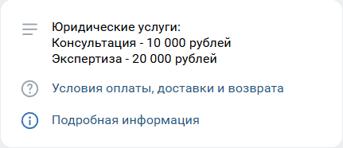
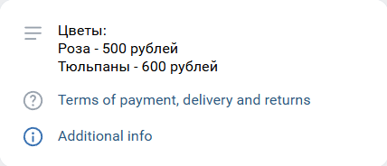
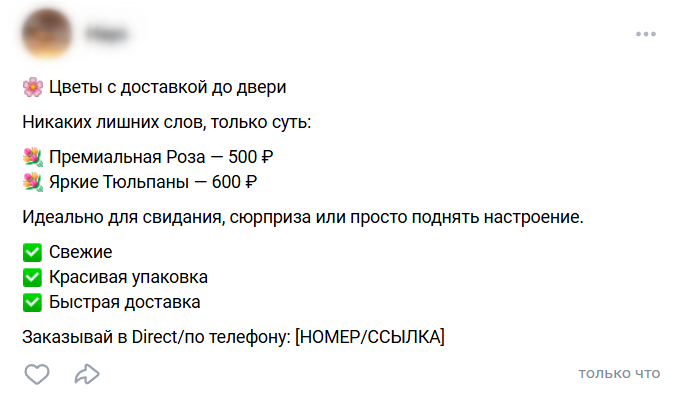
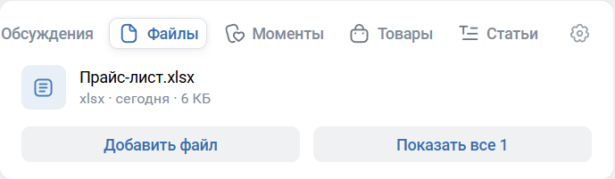
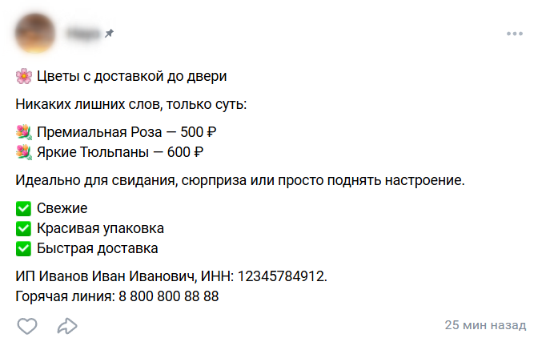

# Требования к подключению сообщества VK

Перед подключением Robokassa убедитесь, что в вашем сообществе VK есть вся обязательная информация.  
Это ускорит модерацию и поможет избежать отказа в подключении.

## Три общих правила.
**На странице сообщества VK должны быть расположены:**  

**1) Название и цены на товары/услуги;**  
Варианты размещения:  
??? example "в описании сообщества"
    
    { style="max-width: 100%; height: auto;" } { style="max-width: 100%; height: auto;" }
    
    *В вашем сообществе нажмите на "⚙ Управление", на открышейся странице в разделе "Описание" введите информацию с ценами и нажмите "Сохранить"*

??? example "в закреплённом посте"
    
    { style="max-width: 100%; height: auto;" }
    
??? example "в разделе "Товары" или "Услуги""
    
    { style="max-width: 100%; height: auto;" }
	
	*В вашем сообществе нажмите на "⚙ Управление", перейдите во вкладку "Разделы", включите раздел "Товары" или "Услуги" передвинув ползунок.  
	Далее, вернитесь на главную страницу сообщества. Обновите страницу нажав F5.  
	Перейдите в раздел "Товары" или "Услуги" и добавьте информацию по прайсу.*
	
??? example "в ссылке на облако"
    
    { style="max-width: 100%; height: auto;" }	
	
	*Загрузить файл прайс-листа можно в любое облачное хранилище: Google Disk, Yandex Drive или в облако вашего сайта.  
	Далее, просто откройте доступ к файлу и создайте ссылку на него*
	
??? example "в файле прайс-листа"
    
    { style="max-width: 100%; height: auto;" }	
	
	*В вашем сообществе нажмите на "⚙ Управление", перейдите во вкладку "Разделы", включите раздел "Файлы" передвинув ползунок.  
	Далее, вернитесь на главную страницу сообщества. Обновите страницу нажав F5.  
	Перейдите в раздел "Файлы" и добавьте файл с прайс-листом.*

**`Цены должны быть указаны явно.`**  
**`Если у товаров/услуг нет фиксированных цен, их можно указать от и до.`**  
**`Например: "Юридические услуги от 10 000 до 50 000 рублей."`** 

 

**2) Оферта ИЛИ условия оплаты и возврата:**  
> **ВАЖНО: Вам не обязательно размещать оферту, если у вас в сообществе уже имеется понятное описание условий оплаты и возврата денежных средств.**  

??? example "Пример 1. Продажа товаров онлайн:"
	**Условия оплаты и возврата**  
	- На сайте доступна оплата картой или через СБП и другими платёжными методами через сервис Robokassa.  
	- Доставка товара происходит с помощью сервиса СДЕК после оплаты заказа. Срок доставки 3-5 рабочих дней.  
	- Возврат денежных средств возможен в течение 14 дней с момента покупки, если товар имеет заводские характеристики и не имеет дефектов.  

??? example "Пример 2. Продажа онлайн-услуг:"
	**Условия оплаты и возврата**  
	- Оплата производится на сайте картой или через СБП.  
	- Доступ к курсу/вебинару открывается автоматически на e-mail после оплаты в течение 5 минут.  
	- Возврат денег возможен при запросе в течение 14 дней, если услуга не была оказана (доступ к материалам не открыт).
	
??? example "Пример 3. Продажа офлайн-услуг:"
	**Условия оплаты и возврата**  
	- Бронь сеанса подтверждается 100% предоплатой на сайте картой или через СБП.  
	- Услуга оказывается в назначенное время по адресу [Адрес].  
	- Возврат предоплаты возможен при отмене записи не менее чем за 24 часа до начала услуги.	
	
??? example "Пример 4. Продажа товаров офлайн"
	**Условия оплаты и возврата**  
	- Товары бронируются через сайт, оплата производится только при получении в магазине наличными или картой.  
	- Заказ хранится в магазине по адресу [Адрес] в течение 3 дней с момента поступления.  
	- Возврат товара надлежащего качества возможлен в течение 14 дней в любом нашем магазине при наличии чека.	

**`Если вы решили разместить оферту - условия оплаты и возврата можно прописать напрямую в ней.`** 
 
Также, вы можете воспользоваться нашим **бесплатным генератором оферты**:  
1. Зайдите в ЛК Robokassa;  
2. Слева в меню выберите "Мои магазины";  
3. По вашему магазину нажмите на "Настройки";  
4. На открывшейся странице пролистайте вниз до раздела "Об оферте", укажите ваш вид деятельности и нажмите "Скачать оферту".  

Данный файл можно отредактировать при необходимости и разместить у вас на веб-ресурсе.

> **Инструкция по размещению:**  
В вашем сообществе нажмите на "⚙ Управление", перейдите во вкладку "Разделы", включите раздел "Файлы" передвинув ползунок.
Далее, вернитесь на главную страницу сообщества. Обновите страницу нажав F5.
Перейдите в раздел "Файлы" и добавьте файл с офертой.

**3) Реквизиты компании и актуальные контакты для связи:**  
Варианты размещения:  
??? example "в описании сообщества"
    
    { style="max-width: 100%; height: auto;" }
    
    *В вашем сообществе нажмите на "⚙ Управление", на открышейся странице в разделе "Описание" введите информацию с ценами и нажмите "Сохранить"*

??? example "в закреплённом посте"
    
    { style="max-width: 100%; height: auto;" }

